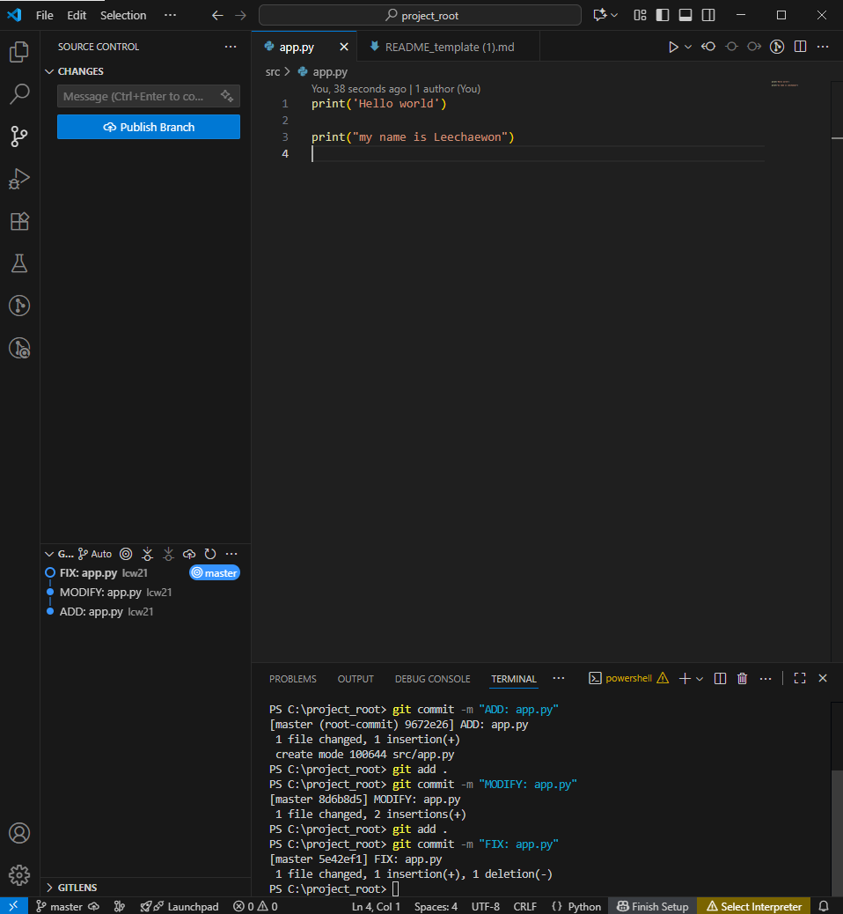
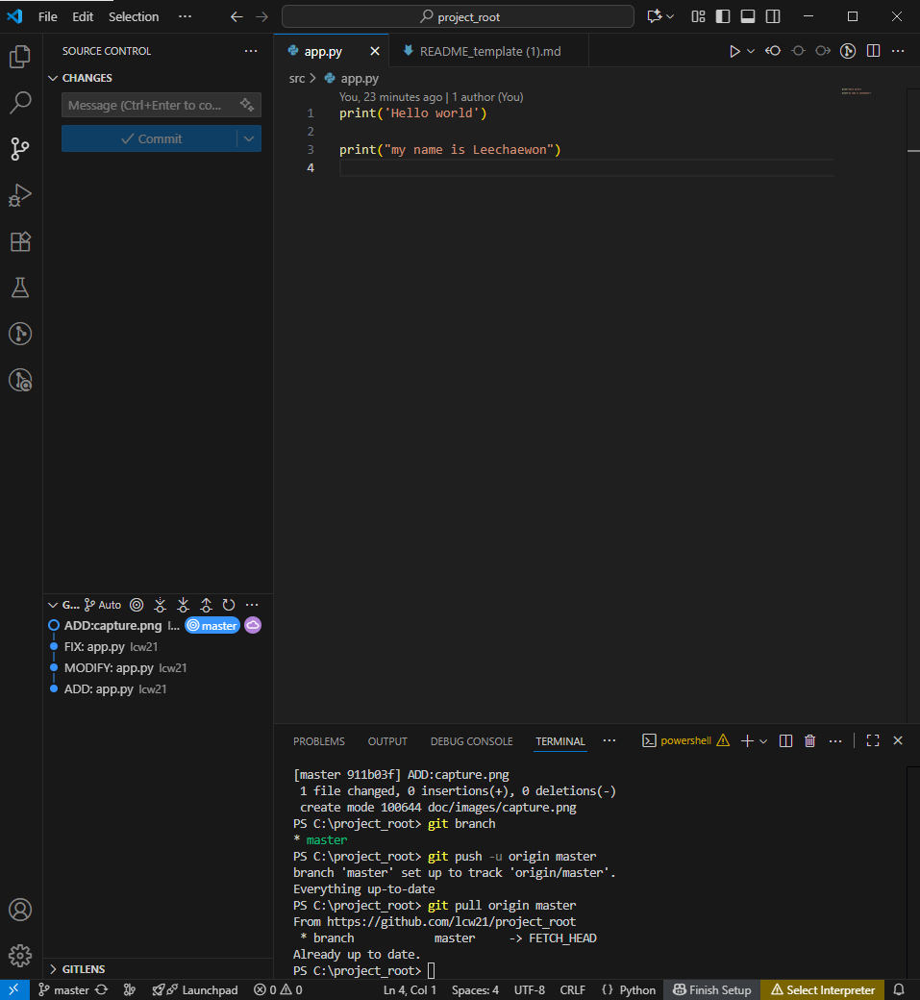

# Python GitHub 과제

## 1. 과제 개요
- VS Code에서 Python 프로젝트를 생성하고 Git/GitHub을 활용하여 버전 관리 및 저장소 연동을 실습한다.  
- commit 메시지 규칙:  
  - 첫 번째: `ADD: ...`  
  - 이후 기능 추가: `MODIFY: ...`  
  - 코드 수정: `FIX: ...`  

---

## 2. 프로젝트 폴더 구조
```
C:.
│  README.md
│  tree.txt
│  
├─doc
│  └─images
│          capture.png
│          capture2.png
│          
└─src
        app.py
```

---

## 3. 수행 과정
1. **src/app.py 작성 및 첫 commit**
   - commit 메시지: `ADD: app.py`  
   - 기능: ['hello wolrd'를 print]  

2. **두 번째 commit**
   - commit 메시지: `MODIFY: app.py`
   - 수정/추가한 내용: [`my name is chaewon`을 print 하는 것을 추가]  

3. **세 번째 commit**
   - commit 메시지: `FIX: app.py`
   - 수정/추가한 내용: [add `Lee`]  

---

## 4. 캡처 이미지
- `capture.png` → commit 완료 상태 화면  
- `capture2.png` → GitHub push → pull 후 VS Code 화면  

 
  
  

---

## 5. GitHub Repository URL
- URL: [https://github.com/lcw21/project_root.git]  

---

## 6. 느낀 점 (선택 사항)
- 이번 과제를 하면서 배운 점:terminer 명령어에 대해 배웠습니다. 그저 클릭으로 커밋을 하는 것이 아닌 명령어로도 커밋을 할 수 있다는 사실을 배우게 됐습니다. 또한 tree 명령어를 배울 수 있었습니다.  
- Git/GitHub을 활용하며 어려웠던 점:폴더 구조를 이해하는 것이 어려웠습니다. 어느 폴더 안에 어떤 파일을 넣어야할지 이해하는 데 시간이 많이 소요됐습니다.   
- 앞으로 더 해보고 싶은 것: 더 다양한 terminer의 명령어를 배우고 싶습니다. 명령어로 할 수 있는 기능들이 또 무엇이 있는지 얼마나 더 쉽게 할 수 있는지 배우고 싶습니다.   


